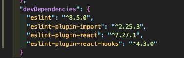
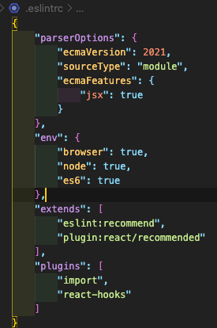

a# 🎯 React-nodeBird 프로젝트

> 프론트: React 를 통한 트위터 클론 프로젝트 (Next.js)프레임워크를 통한 ssr 기법을 적절하게 사용하여 최적화 한 프로젝트 입니다.<br>

> 백엔드:

# 🛠Tech Stack

<p>
    
    
    
    
    
    
</p>

# 🎯 구현기능

### `pages:`

1.홈페이지(index.js)

2.프로필페이지(profile.js)

3.회원가입페이지(signup.js)

### `components`:

1.앱레이아웃(AppLayout.js)

> page들 감싸는 레이아웃 컴포넌트
> 각종 페이지들 링크 포함한 네이비게이터 포함.

# ❓공부하면서 배운점

### 1.eslint 추가 및 설정.

`eslint:` 코드를 분석해 문법적인 오류나 안티 패턴을 찾아주고 일관된 코드 스타일로 작성하도록 도와줍니다.<br>
`eslint 설정에 중요성:` 협업을 할때 Eslint 코드 규칙을 정하면 다른사람들의 코드도 다 같은 스타일로 볼 수 있어서 좋다.<br>

지금은 react 프로젝트를 하기때문에 설치해준게 4개정도 된다

<br>

### 2.초반 eslint 세팅:

아직 제대로 eslint에 대해서 배운게 없어서 일단 기본적인 세팅방식을 참조하였다.<br>
.eslintrc 파일 생성후 밑네 사진과 같이 입력.

<br>

### 3.a태그 사용시 새창으로 띄우는 속성 target="\_blank" 쓸때 rel = "noreferrer noopener" 같이 넣어주자.(보안문제 때문에 쓰는것이 좋다.)

<br>

### 4.react에서 virtual dom 안에서 inline 스타일링 하면 최적화에 방해가 된다

예를 들어서

```js
<Button style={{ backgroundColor: 'black' }} type='link'>
  <Link href='/signup'>
    <a>회원가입</a>
  </Link>
</Button>
```

virtual dom 작성할때 inline 으로 `style={{backgroundColor:"black"}}` 이렇게 스타일링을 한다면 매번 rerendering 할때마다 이 `<Button></Button>` 엘리먼트는 다시 생성해서 다시 그리게 될거다. 왜냐하면 style 안에서 그릴때마다 새로운 객체를 `{}==={} //결과: false(객체는 같은 내용이어도 다르기 떄문이다.)`생성하기 때문에 react에서는 매번 rerendering 할때마다 같은 스타일링이지만 다른 객체로 인식해서 매우 효율을 떨어진다. 해결방법은 이렇게 inline 식으로 스타일링을 하는것이 아닌 따로 빼내서 스타일링 하는것이 최적화에 도움이된다.

### 5.리덕스 에 관하여

내용이 길다보니 벨로그에다가 작성했다. <br>

- <a href="https://velog.io/@sungmin-choi/%EB%A6%AC%EB%8D%95%EC%8A%A4-%EC%82%AC%EC%9A%A9%EA%B8%B0....-with-next.js1">리덕스 기록 1</a> <br/>
- <a href="https://velog.io/@sungmin-choi/%EB%A6%AC%EB%8D%95%EC%8A%A4-%EC%82%AC%EC%9A%A9%EA%B8%B0....with-Next.js2">리덕스 기록 2</a>
